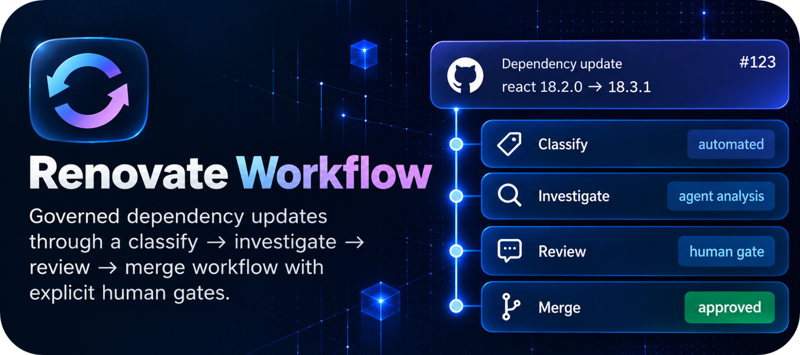

  

 

I'm a senior software engineer based in Sydney, exploring how AI changes the way software is designed, built, reviewed, and maintained.

My recent work focuses on AI-native product engineering and developer workflows: building with LLMs, designing agent-driven systems, and turning experiments into reliable engineering infrastructure.

Most of my current work lives under **[multipliers-dev](https://github.com/multipliers-dev)**. I also write about what I learn on **[DEV Community](https://dev.to/michaeltruong)**, with a more curated view of my work on my **[portfolio](https://portfolio-multipliers-dev.vercel.app)**.

Building with: TypeScript · React · Node.js · PostgreSQL · LLMs · AI agents

## Selected projects

  
  

  
  

