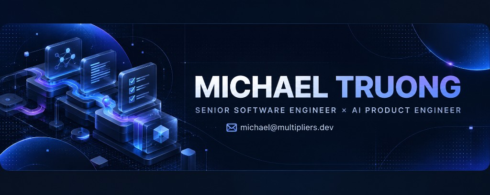

  

I'm a senior software engineer based in Sydney, currently exploring how AI changes the way software is designed, built, reviewed, and maintained.

My recent work focuses on AI-native product engineering and developer workflows: building products with LLMs, designing agent-driven development systems, and turning experiments into reliable engineering infrastructure.

Most of my current projects, including my open-source developer tooling, live under **[multipliers-dev](https://github.com/multipliers-dev)**, an organisation I use for the work I'm building.

## What I'm building

**[Codenames AI](https://codenames-ai.com)** — LLM-powered Codenames exploring constrained generation, validation, multilingual word pools, and AI gameplay.

**[Savepoints](https://dev.to/michaeltruong/the-agent-host-didnt-have-the-lifecycle-boundaries-i-assumed-5akh)** — Capture, review, promotion, provenance, and audit infrastructure for learnings from agent-driven development.

**[Renovate Workflow](https://github.com/multipliers-dev/renovate-workflow)** — Governed dependency updates through a classify → investigate → review → merge workflow with explicit human gates.

**[Cursor Team Marketplace](https://github.com/multipliers-dev/cursor-team-marketplace)** — Reusable agent-assisted engineering workflows for planning, repository bootstrap, and Cloud Agent integration.

I write about what I learn while building these systems on **[DEV Community](https://dev.to/michaeltruong)**.

You can also find the more curated view of my work on my **[portfolio](https://portfolio-multipliers-dev.vercel.app)**.
